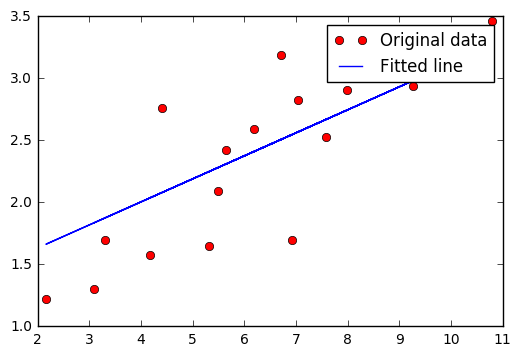

```python
# A linear regression learning algorithm example using TensorFlow library.

```


```python
import tensorflow as tf
import numpy
```


```python
# Parameters
learning_rate = 0.01

# tf Graph Input
inputs = tf.placeholder(expected_shape=[2,], name="inputs")

w = tf.Variable(expected_shape=[2, 2], name="weights")
b = tf.Variable(expected_shape=[1, 2], name="biases")

# Middle layer of neural network 
l = tf.add(tf.matmul(inputs, w), b)

ow = tf.Variable(expected_shape=[2,1], name="output_weight")
ob = tf.Variable(expected_shape=[2,1], name="output_weight")

output = tf.reduce_sum(tf.add(tf.matmul(l, ow), ob))
```


```python
# Mean squared error
cost = tf.reduce_sum(tf.pow(pred-Y, 2))/(2*n_samples)
# Gradient descent
optimizer = tf.train.GradientDescentOptimizer(learning_rate).minimize(cost)
```


```python
# Initializing the variables
init = 
```


      File "<ipython-input-35-468d541316cf>", line 2
        init =
               ^
    SyntaxError: invalid syntax


```python
# Launch the graph
with tf.Session() as sess:
    sess.run(tf.global_variables_initializer())

    # Fit all training data
    for epoch in range(training_epochs):
        for (x, y) in zip(train_X, train_Y):
            sess.run(optimizer, feed_dict={X: x, Y: y})

        #Display logs per epoch step
        if (epoch+1) % display_step == 0:
            c = sess.run(cost, feed_dict={X: train_X, Y:train_Y})
            print "Epoch:", '%04d' % (epoch+1), "cost=", "{:.9f}".format(c), \
                "W=", sess.run(W), "b=", sess.run(b)

    print "Optimization Finished!"
    training_cost = sess.run(cost, feed_dict={X: train_X, Y: train_Y})
    print "Training cost=", training_cost, "W=", sess.run(W), "b=", sess.run(b), '\n'

    #Graphic display
    plt.plot(train_X, train_Y, 'ro', label='Original data')
    plt.plot(train_X, sess.run(W) * train_X + sess.run(b), label='Fitted line')
    plt.legend()
    plt.show()
```

    Epoch: 0050 cost= 0.212132201 W= 0.0445285 b= 2.27669
    Epoch: 0100 cost= 0.196552634 W= 0.0567243 b= 2.18895
    Epoch: 0150 cost= 0.182770312 W= 0.0681949 b= 2.10644
    Epoch: 0200 cost= 0.170577258 W= 0.0789834 b= 2.02882
    Epoch: 0250 cost= 0.159790397 W= 0.0891305 b= 1.95583
    Epoch: 0300 cost= 0.150247589 W= 0.0986741 b= 1.88717
    Epoch: 0350 cost= 0.141805768 W= 0.10765 b= 1.8226
    Epoch: 0400 cost= 0.134337261 W= 0.116092 b= 1.76187
    Epoch: 0450 cost= 0.127730057 W= 0.124031 b= 1.70475
    Epoch: 0500 cost= 0.121884570 W= 0.131499 b= 1.65103
    Epoch: 0550 cost= 0.116713002 W= 0.138523 b= 1.6005
    Epoch: 0600 cost= 0.112137601 W= 0.145129 b= 1.55298
    Epoch: 0650 cost= 0.108090147 W= 0.151342 b= 1.50828
    Epoch: 0700 cost= 0.104509287 W= 0.157185 b= 1.46625
    Epoch: 0750 cost= 0.101341039 W= 0.162681 b= 1.42671
    Epoch: 0800 cost= 0.098538019 W= 0.16785 b= 1.38952
    Epoch: 0850 cost= 0.096058056 W= 0.172712 b= 1.35455
    Epoch: 0900 cost= 0.093863793 W= 0.177284 b= 1.32165
    Epoch: 0950 cost= 0.091922432 W= 0.181585 b= 1.29071
    Epoch: 1000 cost= 0.090204738 W= 0.18563 b= 1.26162
    Optimization Finished!
    Training cost= 0.0902047 W= 0.18563 b= 1.26162 
    





```python
# Regression result
```


```python

```
